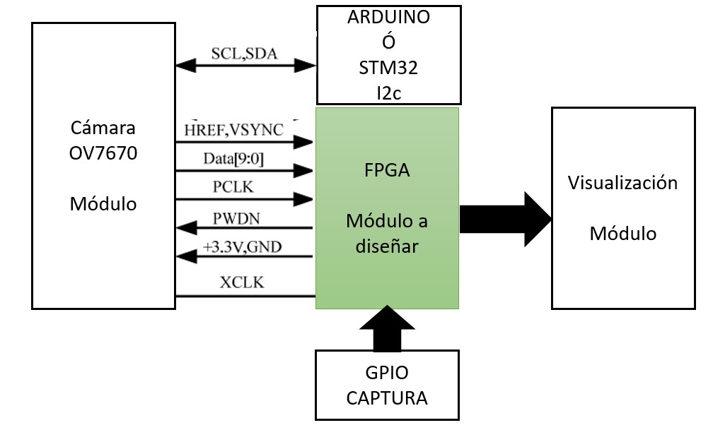
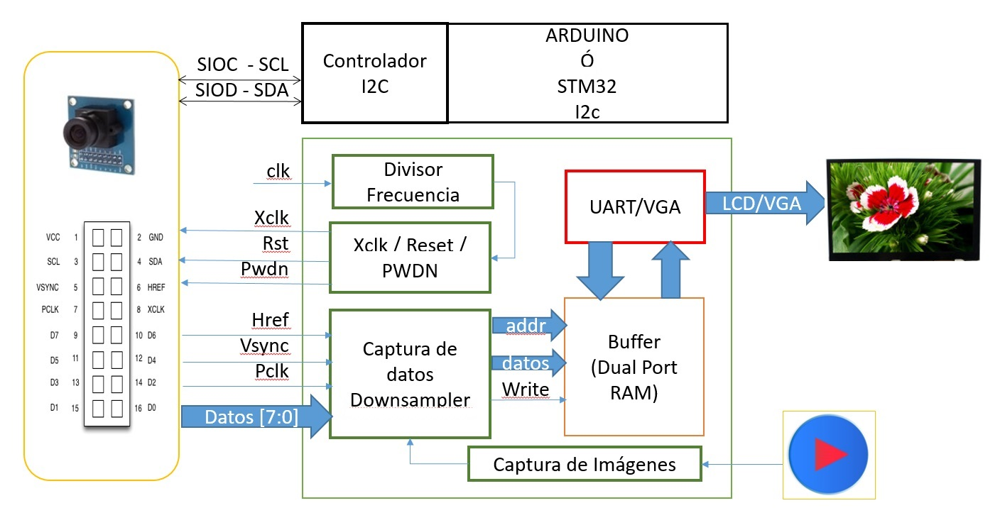

##  ELECTRÓNICA DIGITAL 1 2019 -2 UNIVERSIDAD NACIONAL DE COLOMBIA 

## Introducción 

En las próximas 6 semanas se estará trabajando en la adquisición, procesamiento y visualización de  imágenes. Para ello se hará uso de los siguientes componentes:

* Cámara OV7970 sin FIFO con las siguientes características:
	* Matriz fotosensible: 640 x 480, el tamaño de la imagen   se puede configurar 
	* Formato de salida RGB, RGB (GRB4: 2: 2, RGB565 / 555/444) sin formato, YUV (4: 2: 2) e YCbCr (4: 2: 2) Admite VGA, CIF y de CIF a formato 40 x 30.
	* Se configura  por medio del  bus SCCB (compatible con I2C), para obtener los modos de  configuración se recomienda leer la hoja de datos de la cámara.
* Tarjeta STM o Arduino, En primera instancia  y para las pruebas iniciales, se hará uso de la tarjeta de procesamiento comerciales, como Arduino o STM32 , 
* Tarjeta de desarrollo FPGA, Nexys4, quacho-basic 
* Sistema de visualización 
* Sistema de captura,  sistema manual para iniciar la captura de información

En resumen se muestra la configuración del dispositivo que se implementará.

Como se observa en el diagrama anterior se debe  diseñar por parte de cada grupo de trabajo el contenido del bloque en verde  el cual se describir a continuación:

En este sentido cada grupo debe trabajar en los bloques internos verdes junto con las interconexiones.  Se proporcionarán los bloques en naranja.

El plan de trabajo propuesto es:

* WP01: Buffer de memoria  [WP01](https://classroom.github.com/g/Ra4G34mi) 
	* Semana 1: Buffer de memoria  Simulación (TestBench).  Analizar la máxima memoria ram que podemos alojar en la FPGA,  y planear el método de adquisición de los datos de la cámara 
* WP02  Cuenta de pixle y href [WP02](https://classroom.github.com/g/fTcztVJQ)
	* Semana 2: Captura de datos Construcción del bloque de captura de datos y divisor de frecuencias según hoja de datos de la cámara.
	* Semana 3: Captura de datos Pruebas físicas con cámara 
* WP03: Simulación
	* Semana 4: Procesamiento 
* WP04: Integración e implementación [WP04](https://classroom.github.com/g/-N1YMEhS)
	* Semana 6: Integración del proyecto y pruebas funcionales
Semana 7: Presentación  

## Metodología de trabajo 

Para cada paquete de trabajo se debe clonar la plantilla dada, y los resultados del trabajo de cada grupo deben ser subidos antes de la fecha estipulada. Se recomienda  leer la ayuda de github classroom en este [link](https://education.github.com/) y ver los videos de github de su canal de YouTube de este [link]( https://www.youtube.com/githubguides) o pueden descargar un libro de git del siguiente [link]( https://git-scm.com/book/en/v2)
Antes de empezar  si no ha tenido ningún acercamiento con los repositorios de git  debe realizar los siguientes pasos:
* Crear una cuenta de github. Ver este [video](https://www.youtube.com/watch?v=ezxRcdJ8glM&feature=youtu.be)
* Para crear repositorios  revise este [link](https://help.github.com/en/github/getting-started-with-github/create-a-repo)

Antes de comenzar con cada paquete de trabajo se debe leer las instrucciones  y tener todos los archivos. Para acceder a cada paquete de trabajo debe:
* Aceptar la asignación de cada link dado. 
* La aplicación les pregunta si desean crear un grupo nuevo o unirse a uno existente:
	* Para crear un grupo nuevo coloque "Grupo-xx", donde xx es el número del grupo.
	* Para unirse a un grupo existente, busque el nombre  y pulse el botón ´join´.
	
***Nota: Todos los estudiantes debes unirse al grupo correspondiente  y tener cuidado de no equivocarse de grupo***

Luego de unirse a cada grupo de trabajo debe clonar su  repositorio en su computador, para lo cual: 
* Si usted  no tiene ningún conocimiento de cómo hacer esto, recomiendo  usar ***github Desktop*** el cual se puede descargar de este [link]( https://desktop.github.com), y la documentación  de uso la encuentra en este [link](https://help.github.com/en/desktop/getting-started-with-github-desktop) ***Recuerde lo que debe hacer es clonar el repositorio creado de forma automática por git classroom y NO crear uno nuevo***
* Para los estudiantes que usen el sistema operativo Linux  les recomiendo usar la siguiente guía para clonar el repositorio e iniciar en  el mundo de  control de versiones [link]( https://git-scm.com/book/en/v2/Git-Basics-Getting-a-Git-Repository)

***RECUERDEN:*** Todos los integrantes del grupo deben  trabajar en el respectivo repositorio y participar en los respectivos commit y push, tanto de la documentación

## Documentación
Para todos los paquetes de trabajo se debe  realizar  la documentación respectiva, que evidencie el progreso del trabajo. Puede hacer uso de fotos, videos, comentar el código HDL, y todo lo que el grupo considere necesario  para explicar los avances que va teniendo. 
Recuerde el trabajo que ustedes documenten, será el que leerán sus compañeros de los próximos semestres. En este contexto, la evaluación de la documentación será  tenida en cuenta la minuciosidad y claridad de la misma.

La documentación se debe  diligenciar en el archivo README.md, que se encuentra en cada repositorio dentro de la carpeta docs, en el cual deben colocar el nombre3 de los integrantes  y el  número de identificación.
El archivo README.md, se debe escribir en formato Markdown. Para aprender cual es el formato de este documento se recomienda revisar el siguiente [link](https://guides.github.com/features/mastering-markdown/) que les da una visión rápida de formato usado para hacer la documentación. 
Las imágenes, fotos y soportes gráficos deben ser alojados en la carpeta ‘figs’ y deben ser vinculadas en documento README.md.

# Código HDL
El código HDL está alojado en la carpeta ´src´. Allí  están los archivos fuentes dados en clase  y allí deben alojar todo los archivos  diseñados  y desarrollados por los integrantes de grupo y según sea solicitado en la  guía de cada paquete de trabajo.

# Entrega
Recuerde tener presente el deadline  de cada paquete de trabajo, a las 8 de  la noche del día indicado  se cierra  el sistema  y los grupos no podrán actualizar el repositorio.
Para actualizar el repositorio deben realizar  el respectivo commit y push, según sea la plataforma que estén utilizando y como se explicó en clase.
Recuerda también revisar que en la página de github se refleja las actualizaciones realizadas por el grupo de trabajo 
  

## Desarrollo 
A continuación se presenta cada actividad a realizar, el plan de trabajo del proyecto de cada semana se encuentra en el link de documentación y el link de trabajo se encuentra en la columna  repositorio.

WP  | semana | deadline  | Tema | Documentación| Repositorio 
--  | --     | --        | --   | --          | --  
01| semana 1 | 1 Nov | Buffer de memoria | [link](./docs/WP01.md) | [WP01](https://classroom.github.com/g/Ra4G34mi) 
02| semana 2 /semana 3 | 15 Nov | Captura de datos | [link](./docs/WP02.md) | [WP02](https://classroom.github.com/g/fTcztVJQ)  
03  | semana 4 | 16 ene | Procesamiento | [link](./docs/WP03.md) |  [WP03](https://classroom.github.com/g/dq2gMMs9) 
04| Semana 8 | 6  febrero | Integración | [link](./docs/WP04.md) |  [WP04](https://classroom.github.com/g/-N1YMEhS) 

## GRUPOS DE TRABAJO 

GRUPO  | Entrega WP01  | Entrega WP02  | Entrega WP03 | Entrega WP04 
--     | --            | --            | --           | --            
G01    |  [documento](https://github.com/unal-edigital1-2019-2/work01-ramdp-grupo-01/tree/master/docs/README.md) [repositorio](https://github.com/unal-edigital1-2019-2/work01-ramdp-grupo-01) | [documento](https://github.com/unal-edigital1-2019-2/work02-captura-datos-0v7670-grupo-01/tree/master/docs/README.md) [repositorio](https://github.com/unal-edigital1-2019-2/work02-captura-datos-0v7670-grupo-01) | [documento](https://github.com/unal-edigital1-2019-2/work03-smulacion-ov7670-grupo-01/tree/master/docs/README.md) [repositorio](https://github.com/unal-edigital1-2019-2/work03-smulacion-ov7670-grupo-01) | [documento](https://github.com/unal-edigital1-2019-2/work04-proyectofinal-grupo-01-1/tree/master/docs/README.md) [repositorio](https://github.com/unal-edigital1-2019-2/work04-proyectofinal-grupo-01-1) 
G02    |  [documento](https://github.com/unal-edigital1-2019-2/work01-ramdp-grupo-02/tree/master/docs/README.md) [repositorio](https://github.com/unal-edigital1-2019-2/work01-ramdp-grupo-02) | [documento](https://github.com/unal-edigital1-2019-2/work02-captura-datos-0v7670-grupo-02/tree/master/docs/README.md) [repositorio](https://github.com/unal-edigital1-2019-2/work02-captura-datos-0v7670-grupo-02) | [documento](https://github.com/unal-edigital1-2019-2/work03-smulacion-ov7670-grupo-02/tree/master/docs/README.md) [repositorio](https://github.com/unal-edigital1-2019-2/work03-smulacion-ov7670-grupo-02) | [documento](https://github.com/unal-edigital1-2019-2/work04-proyectofinal-grupo-02-1/tree/master/docs/README.md) [repositorio](https://github.com/unal-edigital1-2019-2/work04-proyectofinal-grupo-02-1) 
G03    |  [documento](https://github.com/unal-edigital1-2019-2/work01-ramdp-grupo-03/tree/master/docs/README.md) [repositorio](https://github.com/unal-edigital1-2019-2/work01-ramdp-grupo-03) | [documento](https://github.com/unal-edigital1-2019-2/work02-captura-datos-0v7670-grupo-03/tree/master/docs/README.md) [repositorio](https://github.com/unal-edigital1-2019-2/work02-captura-datos-0v7670-grupo-03) | [documento](https://github.com/unal-edigital1-2019-2/work03-smulacion-ov7670-grupo-03/tree/master/docs/README.md) [repositorio](https://github.com/unal-edigital1-2019-2/work03-smulacion-ov7670-grupo-03) | [documento](https://github.com/unal-edigital1-2019-2/work04-proyectofinal-grupo-03-1/tree/master/docs/README.md) [repositorio](https://github.com/unal-edigital1-2019-2/work04-proyectofinal-grupo-03-1) 
G04    |  [documento](https://github.com/unal-edigital1-2019-2/work01-ramdp-grupo-04/tree/master/docs/README.md) [repositorio](https://github.com/unal-edigital1-2019-2/work01-ramdp-grupo-04) | [documento](https://github.com/unal-edigital1-2019-2/work02-captura-datos-0v7670-grupo-04/tree/master/docs/README.md) [repositorio](https://github.com/unal-edigital1-2019-2/work02-captura-datos-0v7670-grupo-04) | [documento](https://github.com/unal-edigital1-2019-2/work03-smulacion-ov7670-grupo-04/tree/master/docs/README.md) [repositorio](https://github.com/unal-edigital1-2019-2/work03-smulacion-ov7670-grupo-04) | [documento](https://github.com/unal-edigital1-2019-2/work04-proyectofinal-grupo-04-1/tree/master/docs/README.md) [repositorio](https://github.com/unal-edigital1-2019-2/work04-proyectofinal-grupo-04-1) 
G05    |  [documento](https://github.com/unal-edigital1-2019-2/work01-ramdp-grupo-05/tree/master/docs/README.md) [repositorio](https://github.com/unal-edigital1-2019-2/work01-ramdp-grupo-05) | [documento](https://github.com/unal-edigital1-2019-2/work02-captura-datos-0v7670-grupo-05/tree/master/docs/README.md) [repositorio](https://github.com/unal-edigital1-2019-2/work02-captura-datos-0v7670-grupo-05) | [documento](https://github.com/unal-edigital1-2019-2/work03-smulacion-ov7670-grupo-05/tree/master/docs/README.md) [repositorio](https://github.com/unal-edigital1-2019-2/work03-smulacion-ov7670-grupo-05) | [documento](https://github.com/unal-edigital1-2019-2/work04-proyectofinal-grupo-05-1/tree/master/docs/README.md) [repositorio](https://github.com/unal-edigital1-2019-2/work04-proyectofinal-grupo-05-1) 
G06    |  [documento](https://github.com/unal-edigital1-2019-2/work01-ramdp-grupo-06/tree/master/docs/README.md) [repositorio](https://github.com/unal-edigital1-2019-2/work01-ramdp-grupo-06) | [documento](https://github.com/unal-edigital1-2019-2/work02-captura-datos-0v7670-grupo-06/tree/master/docs/README.md) [repositorio](https://github.com/unal-edigital1-2019-2/work02-captura-datos-0v7670-grupo-06) | [documento](https://github.com/unal-edigital1-2019-2/work03-smulacion-ov7670-grupo-06/tree/master/docs/README.md) [repositorio](https://github.com/unal-edigital1-2019-2/work03-smulacion-ov7670-grupo-06) | [documento](https://github.com/unal-edigital1-2019-2/work04-proyectofinal-grupo-06-1/tree/master/docs/README.md) [repositorio](https://github.com/unal-edigital1-2019-2/work04-proyectofinal-grupo-06-1) 
G07    |  [documento](https://github.com/unal-edigital1-2019-2/work01-ramdp-grupo-07/tree/master/docs/README.md) [repositorio](https://github.com/unal-edigital1-2019-2/work01-ramdp-grupo-07) | [documento](https://github.com/unal-edigital1-2019-2/work02-captura-datos-0v7670-grupo-07/tree/master/docs/README.md) [repositorio](https://github.com/unal-edigital1-2019-2/work02-captura-datos-0v7670-grupo-07) | [documento](https://github.com/unal-edigital1-2019-2/work03-smulacion-ov7670-grupo-07/tree/master/docs/README.md) [repositorio](https://github.com/unal-edigital1-2019-2/work03-smulacion-ov7670-grupo-07) | [documento](https://github.com/unal-edigital1-2019-2/work04-proyectofinal-grupo-07-1/tree/master/docs/README.md) [repositorio](https://github.com/unal-edigital1-2019-2/work04-proyectofinal-grupo-07-1) 

## Presentaciones de ideas de trabajo

GRUPO  | Presentación
--     | --                  
G01    | [drive](https://drive.google.com/open?id=1DiBjuy4bnp4pkhXw8k3nhnDItCzoqp4o)       
G02    | [drive](https://drive.google.com/open?id=1TOibu-Dn2buqlZdv8dcxfHzSpmhZV6Eg)       
G03    | [drive](https://drive.google.com/open?id=1lRJMkxWKL5s5tyEmVS6A0oMXkeiRhvWc)       
G04    | [drive](https://drive.google.com/open?id=1b-u4xtM17JZsFM3HnyVXctgxr3A18QLb)       
G05    | [drive](https://drive.google.com/open?id=1XKifSqyyPo1T_Wdlp6i4Big6CFbGj_r8) *      
G06    | [drive](https://drive.google.com/open?id=1unJBlgiGZGiSPl3-r6PuKc9f2f-GRmM5)       
G07    | [drive](https://drive.google.com/open?id=1vL1mmQSBh9zwgmCMdDh5lLL1q_EOoifg)

## Informes de laboratorios  (5 prelabs)

Grupo	|	labs	|	docs	|	HDL
 --	    |	 --	    |	 --	            |	 --
G01	|	lab01-sumador 1bit (introducción a HDL)	|	[link](https://drive.google.com/open?id=1QJAv7UGuw9zh-KfUQK353QxaaX5oArIj)	|	[link](https://drive.google.com/open?id=1aOBHqn_qoY8eeUo5kCr59b0M2lDa1s7T)
G01	|	lab02-sumador 4 bit (Introducción a lógica Combinacional)	|	[link](https://drive.google.com/open?id=1yPYj6n39pt3OxfMFjpmOgE7gNEv3WPc6)	|	[link](https://drive.google.com/open?id=1PdtCFB06RmXJvpKrfXNVWObWUsxwO8c2)
G01	|	lab03-7 segmentos (implementación de Mux-LUT)	|	[link](https://drive.google.com/open?id=1NDXAiWGKAyGJdAGoXpEATCT3ZdEA0vXI)	|	[link](https://drive.google.com/open?id=1qhudhikWryBpDu7LDlvLOIoJqtM3MPOb)
G01	|	lab04- visualización dinámica (Introducción a Lógica Secuencia)	|	[link](https://drive.google.com/open?id=1s8zIRQ4jJRZqasFDwNHXwM0sFoRbxIwP)	|	[link](https://drive.google.com/open?id=1MMsuOTu2Qqa-PcGKjkjMhuaQV1_K-umH)
G03	|	lab01-sumador 1bit (introducción a HDL)	|	[link](https://drive.google.com/open?id=1Fl13QhdExqsApysn3Qt3RdOBu1VhMeVW)	|	[link](https://drive.google.com/open?id=1QdrmIFLIv2UUASPWWXzfudj09sO2JEw0)
G03	|	lab02-sumador 4 bit (Introducción a lógica Combinacional)	|	[link](https://drive.google.com/open?id=1YV_OOqXUbAhnbxmdv_opQZLw7QUqQlEm)	|	[link](https://drive.google.com/open?id=16Eg26a-BCODa1aPASU6KIQQvPPYM-c6U)
G03	|	lab03-7 segmentos (implementación de Mux-LUT)	|	[link](https://drive.google.com/open?id=1-xo_wIs4cr7xW9tSPIAoviBliK_rV4DJ)	|	[link](https://drive.google.com/open?id=1Kj2f-jVqXm7GB7XRH7xsD0XaL2DESzvY)
G03	|	lab04- visualización dinámica (Introducción a Lógica Secuencia)	|	[link](https://drive.google.com/open?id=1IroohWM7iwQgdN17BbAWqsCgqH5eMLBq)	|	[link](https://drive.google.com/open?id=1DAuBY51WTeexacatZ2RbhJhfSmdExpIy)
G03	|	lab05 -sumador 4 bit secuencial (ejemplo sencillo de maquinas de Estado)	|	[link](https://drive.google.com/open?id=1ktz5tv64MnwQVc-NOlyt-NI4_yB1kkS9)	|	[link](https://drive.google.com/open?id=1mj2HrsLHRslX1-ezYDnaqLoVHWTXZrbC)
G04	|	lab01-sumador 1bit (introducción a HDL)	|	[link](https://drive.google.com/open?id=1p7DSE1IBeZF8G4p15RQvUo3-mlDbjYfo)	|	[link](https://drive.google.com/open?id=1hBqvLy_5C2uNPiPSslSZxO99aV41sSms)
G04	|	lab02-sumador 4 bit (Introducción a lógica Combinacional)	|	[link](https://drive.google.com/open?id=1RfPKE4B3xNPb_jAFsez201xLsHkSUUTA)	|	[link](https://drive.google.com/open?id=12Gh1b1FmS_pc0L6V2Q0e4bpGrAUAqCXs)
G04	|	lab03-7 segmentos (implementación de Mux-LUT)	|	[link](https://drive.google.com/open?id=10E5Fj_8sNGTLtqOAxWA7HSg2q-Z3gkO6)	|	[link](https://drive.google.com/open?id=1z4r0oJYquvPvnPZ2r1B_quPaO0T9YQ3o)
G04	|	lab04- visualización dinámica (Introducción a Lógica Secuencia)	|	[link](https://drive.google.com/open?id=18TeK1eZxrO_F0PC5zmd38xK7OhWZUKNW)	|	[link](https://drive.google.com/open?id=17z5Xaph560eD_H-q2ugnjU849M1yy1cW)
G04	|	lab05 -sumador 4 bit secuencial (ejemplo sencillo de maquinas de Estado)	|	[link](https://drive.google.com/open?id=1ITaw252CsYibHgIZ7ZxZ3io3e6NasUzO)	|	[link](https://drive.google.com/open?id=1JsfHToM4EDHuazgkiExNCUN5prdgDGXc)
G05	|	lab01-sumador 1bit (introducción a HDL)	|	[link](https://drive.google.com/open?id=1BKLmosIxJMNlTsQP23HiCzfX0qpiK-QV)	|	[link](https://drive.google.com/open?id=1b2b6EWJD-XV9ejqMfke4mrL_lRjy3leJ)
G05	|	lab02-sumador 4 bit (Introducción a lógica Combinacional)	|	[link](https://drive.google.com/open?id=1wslQNKZHvl6IjuQ3qcNgd_UjmHXJftLZ)	|	[link](https://drive.google.com/open?id=1A1K5Y0yvFYp9-GsoWwoaPZFrnNUIVABk)
G05	|	lab04- visualización dinámica (Introducción a Lógica Secuencia)	|	[link](https://drive.google.com/open?id=1i7wetMi5aJQnv6p4NFZ_dRdd6LBSpEq8)	|	[link](https://drive.google.com/open?id=1v5jYmGTwuN7NBbn3G4mH-0i-QgobOAAF)

