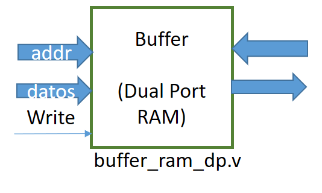

##  ELECTRÓNICA DIGITAL 1 2019 -2 UNIVERSIDAD NACIONAL DE COLOMBIA 
## TRABAJO 01- EVALUACIÓN DE MEMORIA  MÁXIMA 

## Introducción 
Para poder almacenar la información adquirida por la cámara ov7670, y teniendo en cuanta la cámara  usada no tiene memoria FIFO, se debe diseñar e implementar una memora RAM  de doble puerto 

En este paquete  de trabajo los estudiantes deben  responder una serie de preguntas para la implementación de una memoria RAM en la FPGA, y evaluar los  resultados a dichas preguntas por medio de  simulación e implementación del repositorio  dado. 
Para este paquete de trabajo, deben   estar inscrito en un grupo y copiar la información del siguiente link  [WP01](https://classroom.github.com/g/Ra4G34mi) .
Las respuestas deben estar diligencias en el archivo README.md de la carpeta doc. 
*** Recuerde: Revisar  las instrucciones dadas en metodología y documentación.***

## Desarrollo
Analizar la máxima memoria ram que podemos alojar en la FPGA,  y planear el método de adquisición de los datos de la cámara  para lo cual se debe responder las siguientes preguntas:

### Pregunta 1:
¿Definir cuál es el tamaño máximo de buffer de memoria que puede crear?, se recomienda leer las especificaciones de la FPGA que está usando cada grupo. La respuesta se debe dar en bytes.

### Pregunta 2:
¿Cuál formato  y tamaño de imagen de la cámara OV7670  que se ajusta mejor al tamaño de memoria calculado en la pregunta 1?. Para ello revisar la hoja de datos de la cámara OV7670. Revisar el datasheet que se encuentra [aquí](https://github.com/unal-edigital1-2019-2/work1-ram/blob/master/docs/datasheet/OV7670_2006.pdf)

### Pregunta 3:
¿Cuáles son los registros de configuración de la cámara OV7670 que permiten tener la configuración dada en la pregunta 2? Revisen los registros dados de la página 11 a la 26 del datasheet e indiquen la configuración para:

* Restablecer todos los registros
* Habilitar el escalado
* Configurar el formato y el tamaño del pixel
* Habilitar el test de barra de colores

### Simulación (TestBench):

Una vez resultas las anteriores preguntas se  debe descargar el paquete de trabajo 01 de este link  [WP01](https://classroom.github.com/g/Ra4G34mi).
Una vez aceptado el repositorio debe descargarlo en su computador, para ello debe  clonar el mismo. Si no sabe cómo hacerlo  revise la metodología de trabajo, donde se explica el proceso

Una vez clone el repositorio, realice lo siguiente:

* Comprenda cada línea del código HDL del archivo **buffer_ram_dp.v** que se encuentra en la carpera src. Si cree necesario realice los respectivos comentarios  en el mismo archivo.
* Configure los parámetros del ancho de palabra **DW**  y tamaño de dirección **AW**, según los resultados dados en la pregunta 1 y 2.
* Cree el proyecto HDL  donde el top sea **buffer_ram_dp.v**. Puede usar ise o construir el makefile. 
* Modifique el archivo **image.men**, para que contenga todos los pixeles de un solo color  y que corresponda a la memoria calculada.
* Modifique el archivo **TB_ram**, con el fin de adicionar las estímulos necesarios para simular la lectura y escritura de la memoria ram. Genera la simulación 
* Revise que el sistema funciona como usted lo esperaba. Realice lo comentarios necesarios  en el archivo README.md. 
* Realice la respectiva publicación del repositorio antes de la fecha dada. 

