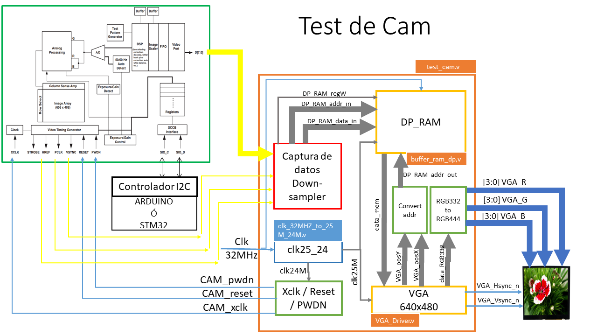
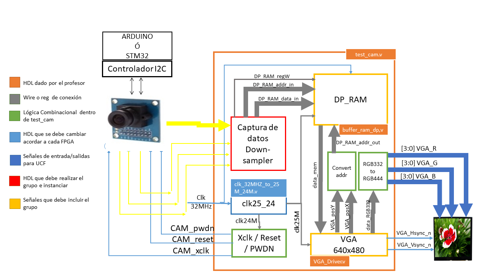
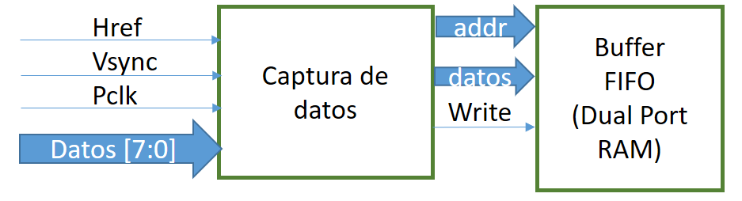
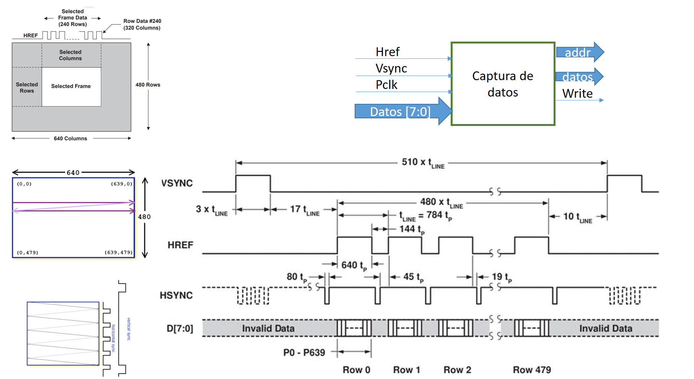
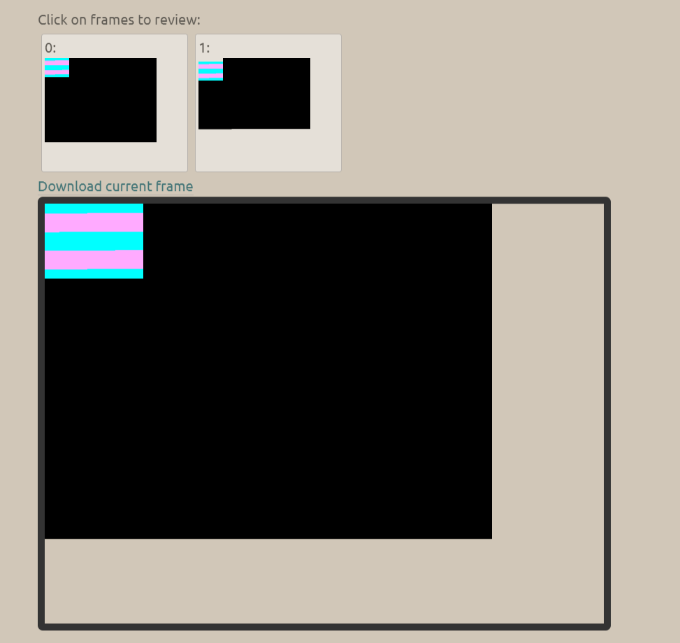
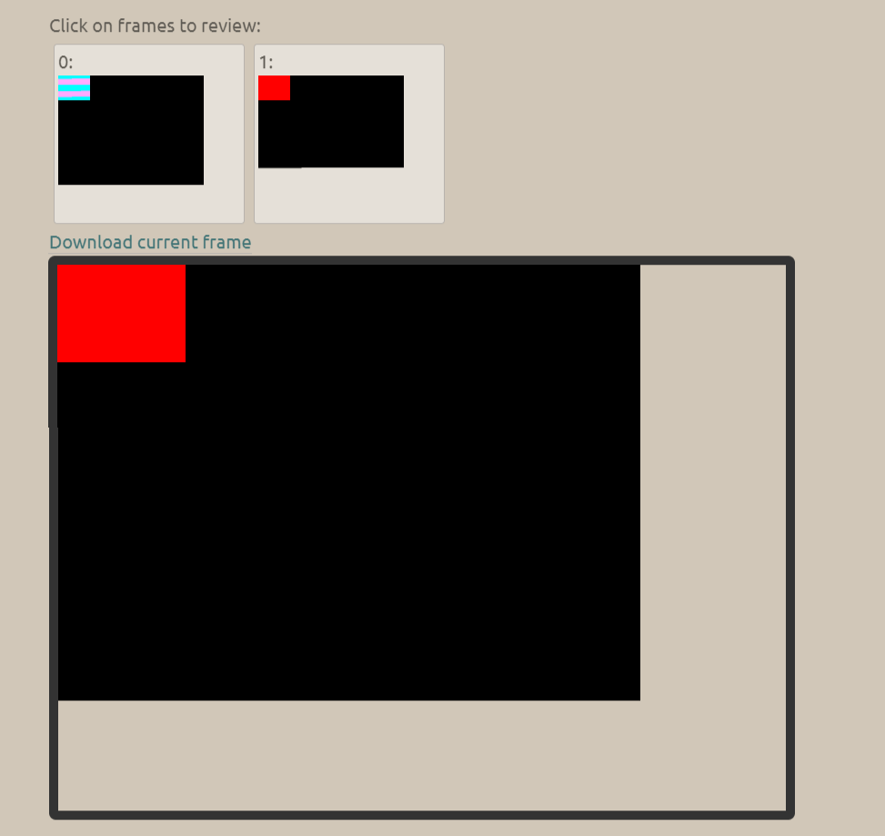

## ELECTRÓNICA DIGITAL 1 2020 -2 UNIVERSIDAD NACIONAL DE COLOMBIA 
## TRABAJO 02- diseño y prueba del HDL para la cámara OV7670

## Introducción 
El sistema de captura de datos de la cámara debe adquirir la información de los pixeles y almacenarlos en el buffer de memoria, analizado en el trabajo anterior.
Se propone el siguiente esquema de trabajo, donde el estudiante puede testear el funcionamiento del driver de la cámara diseñado

En este paquete de trabajo los estudiantes deben, en primera instancia, diseñar e implementar la captura datos de la cámara según la configuración seleccionada en el WP! y, adaptar los datos para que se almacene en memoria el pixel con el formato RGB332.

Luego de tener el diseño "captura_datos_downsampler" deben instanciar el bloque HDL en el test_cam.v. y probar la funcionalidad del diseño. Para ello, debe analizar el proyecto propuesto **test_cam.xise** junto con el siguiente figura:

Como se observa en la figura anterior, el bloque en rojo y las señales en amarillo indican que el grupo de trabajo deben adicionarla dicha información al proyecto **test_cam.xise** para completar el funcionamiento.

El bloque en azul es el PLL que realiza el divisor de frecuencias requeridas 25Mhz y 24Mhz, en el ejemplo este módulo se implementa con una entrada de reloj de 32Mhz y para la FPGA spartan6. Por tal motivo, es necesario que cada grupo adapte este bloque a la tarjeta que está usando. En el desarrollo del paquete de trabajo se da las indicaciones para hacer este proceso. 

Para este paquete de trabajo, el estudiante deben estar inscrito en un grupo y copiar la información del siguiente link [WP02](https://classroom.github.com/g/fTcztVJQ) .
Debe escribir la documentación en el archivo README.md de la carpeta docs. Recuerde, esta documentación debe ser tal que, cualquier compañero de futuros semestres comprenda sus anotaciones y la relación con los módulos diseñados.

***Recuerde: Revisar las instrucciones dadas en metodología y documentación.***

## Material 

Para este paquete de trabajo se debe contar con:

* Pantalla con entrada VGA y cuya resolución sea 640x480.
* FPGA que cuenta con puerto VGA.
* Cable VGA.
* Plantilla del proyecto sugerido [WP02](https://classroom.github.com/a/BE1o1mww) .
* Datasheet de la cámara OV7670.

## Desarrollo

Como se ha explicado en clase, este paquete de trabajo debe desarrollar el siguiente bloque funcional:

Para lo cual, la captura de datos debe ser acorde al funcionamiento de la cámara. para ello debe analizar la siguiente gráfica:

1. Diseñar el sistema digital de captura de los pixeles de la cámara. No es necesario incluir las señales de control  Xclk, pwdn y reset, estas están descritas en el top del proyecto.
2. Diseñar el downsampler y transmitir la información al buffer de memoria. Recuerde la memoria se ha diseñado para almacenar el pixel en formato RGB332, y almacenar 3 bit para el color Rojo y Verde y 2 bit para el color Azul. Si usted, por ejemplo, selecciona el formato RGB565 de la cámara debe convertir los 5 bit de rojo en 3 bit.

***RECUEDE: Es necesario documentar el módulo diseñado con los respectivos diagramas funcionales y estructurales y registrar la información en README.md ***

Una vez clone el repositorio, en su computador de la plantilla del proyecto [WP02](https://classroom.github.com/a/BE1o1mww), realizar lo siguiente:

3. Revisar si el bloque PLL, `clk_32MHZ_to_25M_24M.v` (diagrama azul de la figura 1), propuesto en el bloque test_cam.v, cumple con las necesidades de reloj de entrada y salida para la plataforma utilizada. Recuerde el sistema requiere además de los 32, 50 o 100 Mhz de entrada, generar dos señales de reloj de 25Mhz y 24 Mhz para la pantalla VGA y la Cámara respectivamente. En este sentido, el archivo `clk_32MHZ_to_25M_24M.v` se encuentran en el interior de la carpeta `hdl/scr/PLL`, se debe modificar. 

Para este hito se recomienda generar un nuevo PLL con `Clocking Wizard`. en el IDE de ISE debe utilizar `tools -> Core Generator ...` y general el ip con Clocking Wizard. Una vez, generado el nuevo bloque de Clk:
* Copiar el archivo en la carpeta `hdl/scr/PLL`.
 	* Remplazar en el proyecto **test_cam.xise**, el archivo `clk_32MHZ_to_25M_24M.v` por el generado pro ustedes.
 	* Cambiar los datos necesarios en el archivo `test_cam.v` para instanciar el nuevo PLL.
 	* Documentar en README.md el proceso realizado.

4. Modificar el módulo `test_cam.v` para agregar las señales de entrada y salida necesarias para la cámara (señales amarillas del diagrama). 
5. Instanciar el módulo diseñado en el hito 1 y 2 en el módulo `test_cam.v`.
6. Implementar el proyecto completo y documentar los resultados. Recuerde adicionar el nombre de las señales y módulos en la figura 1 y registre el cambio en el archivo README.md

### Simulación

Como se ha explicado en la reuniòn es un entorno de simulación completo de la càmara y la pantalla VGA.

A la plantilla de proyecto se adicionan los siguientes archivos:
1. ***cam_read.v*** fichero que contiene la declaraciòn de la caja negra, con las respectivas entradas  y salidas. Este archivo debe se utilizado para realiza la descripción funcional de la captura de datos de la camara en formato RGB565
2. ***test_cam_TB.v*** fichero que contiene la simulación de las señales  de la camara y almacena la salida VGA en un archivo de texto plano.  

***RECUEDE: Es necesario documentar el módulo diseñado con los respectivos diagramas funcionales y estructurales y registrar la información en README.md ***

Una vez clone el repositorio, en su computador de la plantilla del proyecto 

1. Cargar el proyecto en el entorno y analizar el archivo ***test_cam_TB.v***.
2. En las propiedades de simulaciòn modificar el tiempo de simulación a 30ms. y generar la simulación.
3. Una vez terminada la simulaciòn revisar dentro del directorio `HW` que contenga el fichero ***test_vga.txt***
4. ingresar a la web [vga-simulator](https://ericeastwood.com/lab/vga-simulator/)  y cargar el archivo ***test_vga.txt***, dejar los datos de configuraciòn tal cual como aparecen. 
5. ejecutar `submit`. 
6. Compruebe que el resultado en la web es la siguiente imagen

***Nota:*** Observe que en esta instancia usted no ha modificado el hardware del proyecto, por lo tanto, lo que observa en la pantalla VGA simulada, es la imagen almacenada en memoria por defecto.

7. Una vez tenga listo el anterior entorno de trabajo, debe proceder a  modificar el fichero  ***cam_read.v***. Solamnte en este módulo debe trabajar  y describir el funcionamiento de la adquiciòn de los datos de la cámara. 

8. Al terminar de decribir la adquisión de la cámara repita los paso 2 a 6.  Si el resultado es el que se observa en la siguiente imagen, indica que el módulo cam_read es adecuado y por lo tanto, se dara por terminado este paquete de trabajo, de lo contrario  vuelva al punto 7.

la imagen muestra que se adquirió una foto de color rojo.

***RECUEDE: Es necesario documentar la simulación y registrar la información en README.md, lo puede hacer con ayuda de imágenes o videos***

### Implementación 

Al culminar los hitos anteriores deben:

1. Crear el archivo UCF.
2. Realizar el test de la pantalla. Programar la FPGA con el bitstream del proyecto y no conectar la cámara. ¿Qué espera visualizar?, ¿Es correcto este resultado ?
3. Configure la cámara en test por medio del bus I2C con ayuda de Arduino. ¿Es correcto el resultado? ¿Cada cuánto se refresca el buffer de memoria ?
4. ¿Qué falta implementar para tener el control de la toma de fotos ?

***RECUEDE: Es necesario documentar la implementación y registrar la información en README.md, lo puede hacer con ayuda de imágenes o videos***

